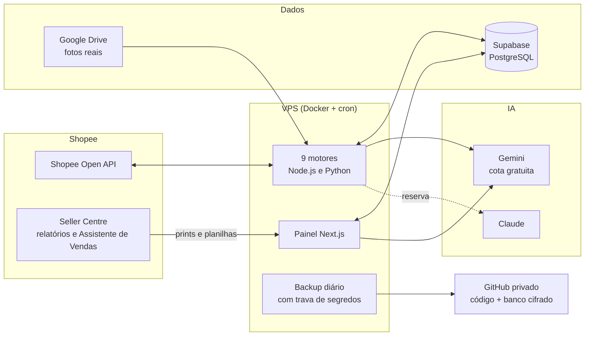
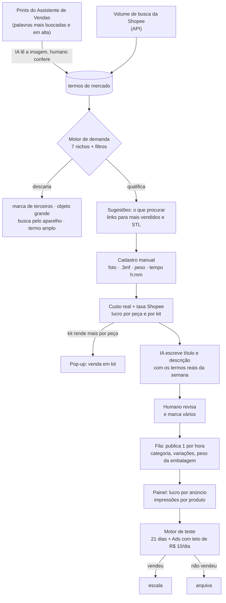

# Tecnoze OS

**O sistema operacional de uma loja de impressão 3D na Shopee.**

A Tecnoze 3D é uma operação enxuta em Salvador-BA: uma pessoa e três impressoras 3D. O Tecnoze OS existe para que essa pessoa gaste o tempo imprimindo, embalando e enviando. Pesquisa de demanda, cálculo de custo, texto de anúncio, publicação, preço, anúncios pagos e backup ficam com o sistema.

> Este repositório é uma vitrine do projeto. O código de produção é privado. Aqui estão a arquitetura, os fluxos e as decisões por trás dele.

---

## Em números

| | |
|---|---|
| Motores de automação | **9** |
| Tabelas no banco (PostgreSQL / Supabase) | **60** |
| Migrations versionadas | **53** |
| Tarefas agendadas rodando na VPS | **18** |
| Casos de teste automatizados | **115** |
| Telas no painel / rotas de API | **28 / 72** |
| Banco, IA de texto e backup | **planos gratuitos** |

Projeto iniciado em julho de 2026.

---

## Arquitetura

---

## Do "o que vender" ao anúncio no ar

O fluxo que roda hoje, do sinal de demanda até o anúncio publicado e medido:

---

## Os motores

| Motor | O que faz |
|---|---|
| **Autorização Shopee** | Assina as chamadas da API e renova o acesso da loja sozinho. |
| **Dados Shopee** | Guarda todo dia vendas, visualizações e preço atual de cada anúncio, a saúde da conta e os avisos da Shopee. |
| **Demanda** | Cruza as buscas reais da Shopee com o Assistente de Vendas e sugere o que produzir. |
| **Geração de anúncio** | Escreve título e descrição, escolhe a categoria e publica em fila, 1 por hora. |
| **Marketing e conversão** | Calcula o custo real de cada peça (filamento, máquina, embalagem) e acompanha preço e margem. |
| **Teste e tráfego** | Dá a cada produto novo um período de teste com Ads de orçamento fixo e decide, por regra, se escala ou arquiva. |
| **Imagem** | Lê as fotos reais do Drive, uma pasta por produto. |
| **Conteúdo Instagram** | Mantém a vitrine de peças sob encomenda. |
| **Inteligência de mercado** | Lê os relatórios exportados do Seller Centre e aponta gargalos de oferta. |

---

## Decisões que guiam o projeto

**Margem mínima de 30%.** Todo preço passa por essa régua. O painel mostra em vermelho o que está abaixo dela.

**A IA redige, mas não inventa fatos.** O modelo escreve o texto do anúncio, mas peso, medidas e material vêm da ficha técnica. Uma validação recusa o texto se aparecer um número que não está no cadastro, uma marca de terceiros ou uma promessa falsa (como "metal" numa peça de plástico).

**Regras explícitas, sem pontuação mágica.** Cada decisão automática grava o motivo em texto: por que um termo foi descartado, por que um produto foi arquivado, por que o Ads subiu.

**Nada pago sem retorno medido.** Banco no plano gratuito, IA de texto na cota gratuita com outra IA de reserva, backup no GitHub. Ads só sobem de teto quando o retorno (ROAS) está comprovado em números.

**Segurança antes do backup.** Antes de cada envio para o GitHub, o sistema compara os arquivos com todas as chaves reais da VPS e cancela o envio se encontrar alguma. Os dados do banco vão criptografados (AES-256) e só as 3 cópias mais recentes ficam guardadas.

**O humano só faz o que só o humano faz.** Imprimir, embalar, fotografar a peça real e revisar o texto antes de publicar.

---

## Um exemplo: por que vender em kit

Na faixa de R$ 8 a R$ 79,99 a Shopee cobra **20% + R$ 4 fixos por item vendido**. Numa peça barata, a parte fixa pesa muito. Exemplo com números ilustrativos, para uma peça que custa R$ 2,00 para produzir e R$ 0,06 de embalagem:

| Opção | Preço | Taxa Shopee | Custo | Lucro | Lucro por peça |
|---|---|---|---|---|---|
| 1 unidade | R$ 12,90 | R$ 6,58 | R$ 2,06 | R$ 4,26 | R$ 4,26 |
| Kit com 3 | R$ 34,90 | R$ 10,98 | R$ 6,06 | R$ 17,86 | **R$ 5,95** |

O kit cobra menos por peça do cliente e ainda rende 40% a mais por peça para a loja, porque a taxa fixa e a embalagem são pagas uma vez só. A tela de cadastro faz essa conta sozinha e avisa quando o kit compensa.

---

## Stack

- **Painel:** Next.js 16, React 19, Tailwind, Recharts
- **Motores:** Node.js (sem dependências externas) e Python
- **Banco:** Supabase (PostgreSQL) com RLS
- **Infra:** VPS Linux, Docker, cron, systemd
- **IA:** Gemini (visão e texto) com Claude de reserva
- **Integrações:** Shopee Open API v2, Google Drive API

---

## Linha do tempo

| Data | Marco |
|---|---|
| jul/2026 | Primeira versão: autorização Shopee, banco e painel |
| set/2026 | Leitura dos relatórios do Seller Centre e histórico por período |
| set/2026 | Custo real por peça (fórmula da fábrica: energia, manutenção, perda de filamento) |
| set/2026 | Motor de teste de produto com Ads de teto fixo |
| set/2026 | Painel de lucro por anúncio e cadastro manual com simulação de kit |
| set/2026 | SEO por IA com os termos reais do Assistente de Vendas e publicação em fila |
| set/2026 | Backup automático do código e do banco cifrado |

---

*Tecnoze 3D · Salvador-BA · peças em PLA e PETG feitas por impressão 3D.*
